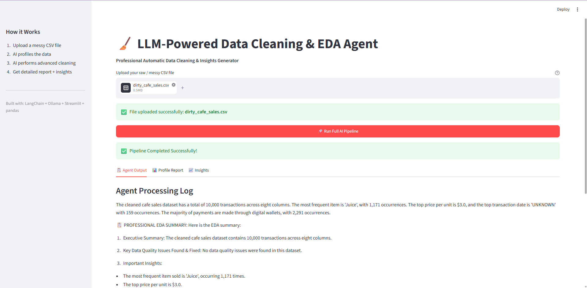

# 🧹 LLM-Powered Data Cleaning & EDA Agent

An intelligent agent that automatically profiles, cleans messy CSV datasets, and generates professional EDA reports using local LLM (Ollama).



## ✨ Features
- Automatic data profiling with **ydata-profiling**
- Advanced data cleaning (missing values, duplicates, outliers, text standardization)
- Professional EDA summary with insights and recommendations
- Interactive HTML report + downloadable cleaned CSV
- Fully local (no API costs after setup)

## 🛠️ Tech Stack
- **LangChain** + **Ollama** (Llama 3.2)
- **Streamlit** (Web UI)
- **pandas** + **ydata-profiling**

## 📸 Screenshots

### 1. Upload & Run Pipeline
![Upload Screen][(screenshots/upload_screen.png)](https://github.com/manjeet7381/LLM-EDA-Agent/blob/main/screenshots/upload_screen.png)

### 2. Agent Processing & Summary
![Agent Output][(screenshots/Agent_processing_and_summary.png)](https://github.com/manjeet7381/LLM-EDA-Agent/blob/main/screenshots/Agent_processing_and_summary.png)

### 3. Interactive Profile Report
![Profile Report][(screenshots/Interactive_profile_report.png)](https://github.com/manjeet7381/LLM-EDA-Agent/blob/main/screenshots/Interactive_profile_report.png)

### 4. Cleaned Data Sample
![Cleaned Sample][(screenshots/cleaned_sample.png)](https://github.com/manjeet7381/LLM-EDA-Agent/blob/main/screenshots/cleaned_sample.png)

## 🚀 How to Run Locally

1. Install [Ollama](https://ollama.com/download) and pull the model:
   ```bash
   ollama pull llama3.2
